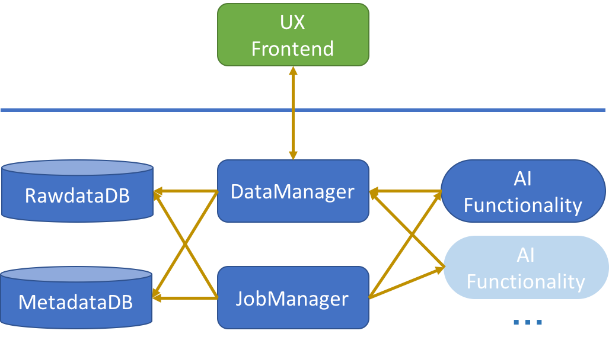

# Unno
Unno is an AI-enabled, extensible and scalable video annotation platform. 

## Introduction
Unno is an open-source project conducted by the Futurewei Cloud Enterprise Intelligence (Cloud-EI) team. The goal of Cloud-EI team is to provide inclusive AI: afordable, effective, and reliable for companies, research groups and communities. 

Nowadays, the massive adoption of AI technologies relies on the availability of big data, computing power,
 and deep learning algorithms. It has become a routine to pipeline a project by collecting a large amount of high 
 quality labeled data, and build a deep learning model with GPU computing. However, it is very time-consuming and costly
 to collect large amounts of high quality labeled data. When it comes to collecting high quality labeled _video_ data,
 it becomes even harder. This motivates us to start this project to help users annotating videos automatically with 
 human in the loop.

Unno provides a data annotation solution of building model-backed assistive annotation pipeline. With the modular
 design, it is flexible to extent and scale advanced AI capabilities to boost annotation efficiency and 
 improve annotation quality.
 
#### Demo: 
* [dropbox](https://drive.google.com/file/d/1HInoAlDq1A0LYZ6hE4pCc0UBhLf0qxzL/view?usp=sharing)
* 百度网盘：链接: https://pan.baidu.com/s/17dNlZ-aTFD3MzXak00uDhw 提取码: rwgk 复制这段内容后打开百度网盘手机App，操作更方便哦

#### Join the Community
Feel free to communicate with us via: 

 - [Issues](https://github.com/futurewei-cloud/cloud-ei-research/issues): bug reports, feature requests, etc.
 - [Slack]() and [Stackoverflow](https://stackoverflow.com/questions/tagged/futurewei-cloud-ei)
 - [Wiki](https://github.com/futurewei-cloud/cloud-ei-research/wiki): design documents
 - Blog and newsletter: [Medium](https://medium.com/)
 
 #### Attend the Planning Meeting
 - [Monthly Zoom Meeting](https://futurewei.zoom.us/j/3502105016
) - The first Friday of each month, 2:00 PM - 3:00 PM Pacific Time
 - [The Next Zoom Meeting](https://futurewei.zoom.us/j/96595033234?pwd=b29GUStzUHI0ZVZHWEx5R0JvWkgxZz09) - 8/20/2020 6:30 PM - 8:30 PM Pacific Time
 - Materials [pdf link](https://www.dropbox.com/s/vvpr28lwg3llgeu/Project_Summary_July2020_v6-Reviewed.pdf?dl=0)

 
## Supported Features
V1 Release:
* Video data import and management
* Bounding box annotation in video
* Category (class) annotation and entity (identification) annotation in video
* Model-based automatic entity tracking within video
* Annotation result export

## System Overview

The system is built upon individual modules, which are standalone services that can be containerized and deployed in 
different computing nodes. End-users only interact with the browser based UX Frontend. Communications across modules are
achieved by RESTful APIs.

* RawdataDB: object storage to host original data to be annotated.
* MetadataDB: database to host all meta data including actual annotations.
* DataManger: service as a data gateway to handle all data interactions between modules.
* JobManager: service to distribute AI model prediction jobs to available AI functionality nodes
* AI Functionality: automatic annotation generation service hosting AI models to achieve model based predictions. 
Customized AI capability can be instantiated as specific AI Functionality module.
* UX Frontend: web based user interface to manage data and conduct annotating process.

## Get Started
To run the system, both backend and frontend modules should be started. 
1. Follow [database service instructions](BackendManager/components/BaseDatabase) to set up base
   database, including Relationtional Database (MySQL) and Key-Value storage
   (MiniIO).
2. Start the [data manager service](BackendManager/components/DataManager)
   following the instruction therein. This is the only service that frontend UX
   interacts with.
3. Start each of the AI Functionality modules:
    * [tracking module](BackendFunctionalModule/tracking)
    * you can add your own AI capability as you need, following tracking module
4. Launch the [job manager service](BackendManager/components/JobQueueManager/README.md) to handle all AI prediction requests.
5. Build and publish the UX frontend with a web server with the [detailed instructions](Frontend)
6. Open a web browser and hit your UX host. Enjoy data annotating!

## Future Plans
Unno will be kept evovling with more advanced functionalities and better user experiences. Things in the roadmap to explore:
* Functionalities
    * support arbitray polygon annotations
    * support label the entire frame
    * support object category suggestions
    * support automatic scene boundary detection
    * chain up multiple AI models' capability for advanced features
* Experience
    * support customized duration to predict
    * export annotations for all videos
    * support annotation timeline for better data visualization
    * support multiple user accounts and collabration
